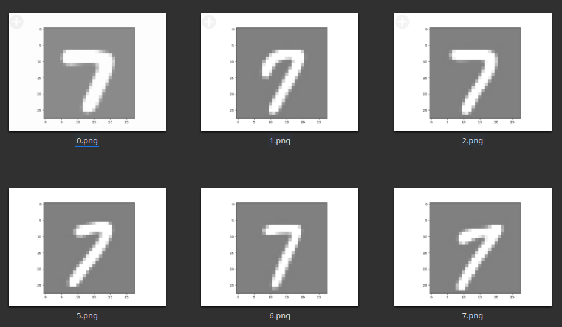
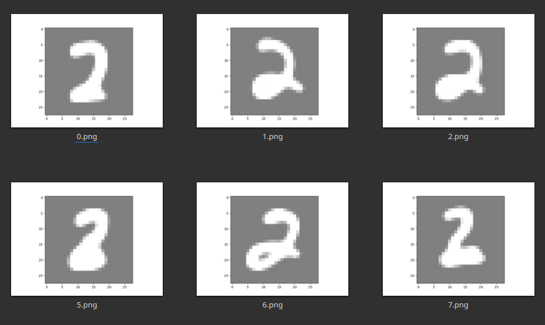

# DDPM

A Simple implementation of DDPM model in PyTorch.

It's just for fun, the Unet model does not include attention, normalization, etc.


## Classifier Guidence DDPM
ref: Diffusion Models Beat GANs on Image Synthesis (https://arxiv.org/abs/2105.05233)
- generate "7"
    - 
- generate "2"
    - 

## Traning

Before training, please set up the config.ini file:

```ini
[unet]
batch_size = 256
time_emb_dim = 128
device = cuda
epoch_num = 500
learning_rate = 1e-4

[ddpm]
iteration = 500
```

To start training, run:

```
$ python train.py
```

## Sampling

To generate 16 pictures, run the following command:

The pictures will be output to the `./output` directory.

```
$ python sample 16                  # unconditional
$ python sample 16 7                # condiditional, want to generate "7" pictures
```